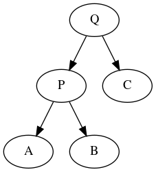
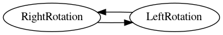
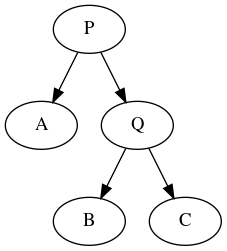

# Tree Data Structure #
## Binary Tree ##
### Definition ###
1. Depth of a node: the number of edges from the node to the tree's root node. A root node has a depth of 0.
2. Level: is defined by 1 + the number of connections between the node and the root. = depth + 1
3. Height of a node: the number of edges on the longest path from the node to a leaf. A leaf node has a height of 0.
4. Height of a tree = height of its root node = the depth of the deepest node.
5. Diameter or width of a tree = number of nodes on the longest path between any two leaf nodes.

## Binary Search Tree ##
### Definition ###
A node-based binary tree data structure with the following properties:
1. The left subtree of a node contains only nodes with keys lesser than the key of that node
2. Same for a right subtree
3. The left and right subtree must also be a binary search tree

## Red Black Tree ##
### Properties ###
1. Every node is colored red or black
2. Root node is a black node
3. NULL children count as black nodes
4. Children of a red node are black nodes
5. For all nodes x:
   - all paths from x to NIL's have the same number of black nodes on them
### Insertion ###
1. Recoloring
2. Rotation

## AVL Tree ##
### Definitions ###
AVL tree is a self-balancing BST  where the difference between heights of left and right subtrees cannot be more than 1 for all nodes
1. Left Rotation

```
def left_rotation(subtree) :
    A, P, right = subtree
    B, Q, C = right
    return (A, P, B), Q, C)
```

2. Right Rotation

```
def right_rotation(subtree) :
    left, Q, C = subtree
    A, P, B = left
    return (A, P, (B, Q, C))
```

### Insertion ###
#### Procedure ####
1. Normally insert into tree in BST way
2. Check balance and rotate
   1. Left Left Case: right_rotate(node)
   2. Left Right Case: left_rotate(node->left) then right_rotate(node)
   3. Rigt Right Case: left_rotate(node)
   4. Right Left Case: right_rotate(node->right) then left_rotate(node)

### Deletion ###
#### Procedure ####
1. Normally delete from the tree in BST way
2. Check balance and rotate

  

## Graphviz for visualization ##
### Sample dot file ###
sample.dot

```
digraph {
    1 -> 0.5;
    10 -> 3;
    10 -> 12;
    1 -> 10;
}
```
### Commands ###
```
# dot -T[format] [dot file] > [output file name].[format]
dot -Tpng sample.dot > output.png
```
