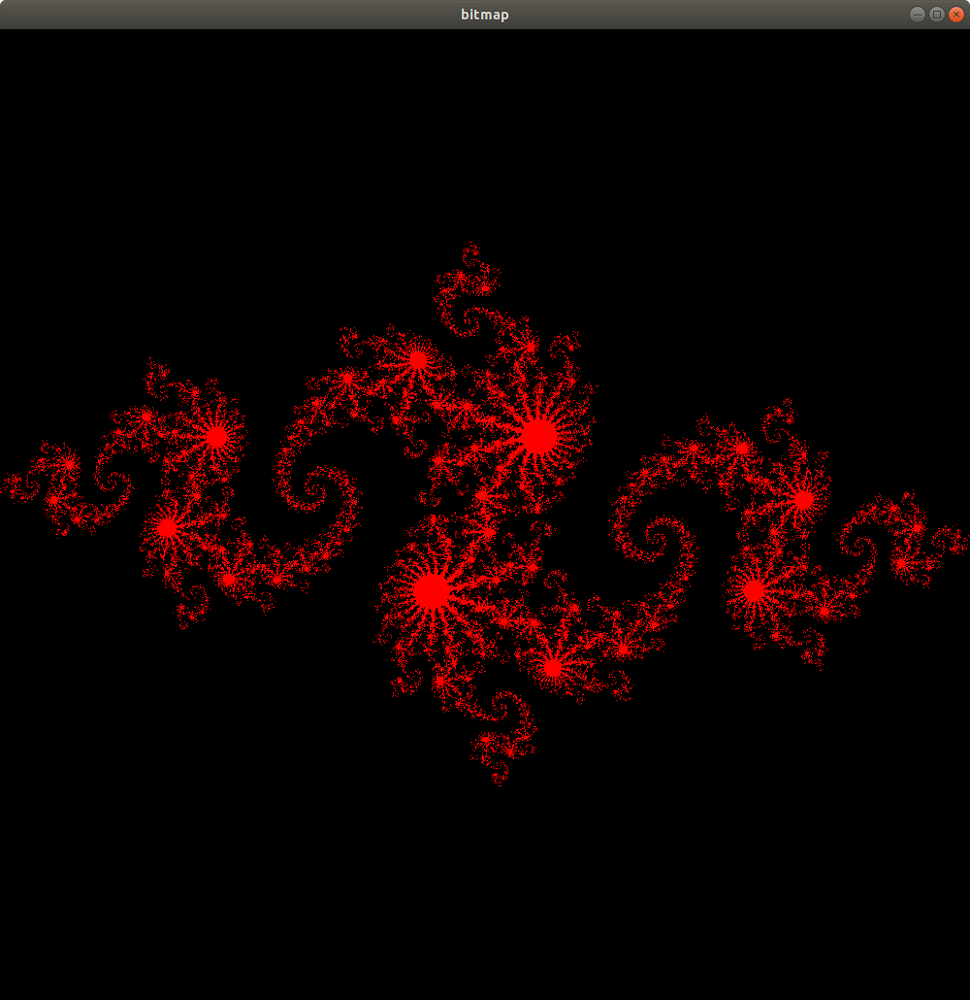

# CUDA Programming Introduction #
***

## Architectures ##
***

- Tesla -> Fermi -> Kepler -> Maxwell -> Pascal -> Volta

## Basics ##
***
- CPU = Host, GPU = device
- GPU tasks (kernels)
- CUDA program needs to control CPU/GPU interaction; handle paralellism; control execution sequence on GPU.
- CUDA accelerated code is lnked with CUDA runtime lib (-lcudart).
- Common qualifiers
```text
__global__ GPU kernels that is callable by CPU
__device__ GPU kernels that is callable by GPU
__host__ or no qualifier masks CPU functions
```
- A CUDA kernel is a grid of thread blocks. The grid can be 1D, 2D or 3D.
- A thread block is, in turn, 1D, 2D or 3D array of threads.
- A thread is executed by exactly one stream processor or CUDA core.
- A thread block is executed by exactly one streaming multiprocessor
- ***CUDA does not allow communication/synchronization among thread blocks. Only thread within the same thread block can communicate/synchronize.***
- Block/ Thread Indexing
```text
thread index within a thread block threadIdx(.x,.y,.z)
block index within a kernel grid blockIdx(.x,.y,.z)
dimension of a thread block blockDim(.x,.y,.z)
dimension of a kernel grid gridDim(.x,.y,.z)
default value of .y,.z is 1
```
- Basic CPU code skeleton:
```cpp
int main() {
    // Allocate & initialize memory of CPU
    // Allocate memory on GPU using cudaMalloc
    // Off-load input data from CPU to GPU using cudaMemcpy
    // Launch the GPU kernels
    // Copy the result back from GPU to CPU using cudaMemcpy
    // Free CPU resources
    // Free GPU resources using cudaFree()
}
```

- Memories

| Memory    | Access Pattern | Speed | Cached? | Scope                | Lifetime       |
|-----------|----------------|-------|---------|----------------------|----------------|
| Global    | Read Write(RW) | Slow  | Yes     | Host and All Threads | Entire Program |
| Local     | RW             | Slow  | Yes     | Each Thread          | Thread         |
| Registers | RW             | Fast  | -       | Each Thread          | Thread         |
| Shared    | RW             | Fast  | No      | Each Block           | Block          |
| Constant  | Read(R)        | Slow  | Yes     | Host and All Threads | Entire Program |
| Texture   | R              | Slow  | Yes     | Host and All Threads | Entire Program |

## Examples ##
- julia set
 
