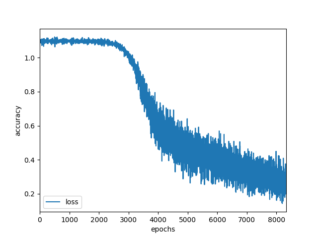
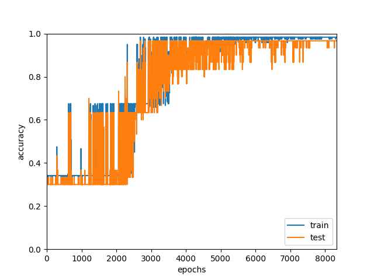

## Simple Classification Neural Network Trained on Iris Dataset

# Requirements
 - Use python3 with your pyenv or virtualenv
 - pip install -r requirements

# How to run
 - Training: run the following command. Weights for the current model will be saved into models directory. Loss and accuracy logs will be saved into logs directory
 ```bash
 python train.py
 ```
 - Testing: test will be run in parallely during training. If you want to see the test result seperatedly for the current trained model. Run:
 ```bash
 python test.py
 ```
 - Visualization: Run the following command to get the loss and accuracy graph saved in logs directory
```bash
 python visualization.py
 ```

# Network Design
 - Optimizer: SGD
 - batch size: 5
 - lr: 0.01
 - Iris Dataset is seperated into (train: 0.8, test 0.2)
# Result:
 - Loss Graph

<p align="center">
   
</p>

 - Accuracy Graph

<p align="center">
   
</p>
