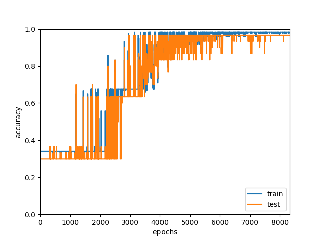

## Simple Classification Neural Network Trained on Iris Dataset

# Requirements
 - pip install -r requirements

# How to run
 - Hoge

# Network Design
 - Optimizer: SGD
 - batch size: 5
 - lr: 0.01

# Result:
 - Loss Graph

   

 - Accuracy Graph

   

