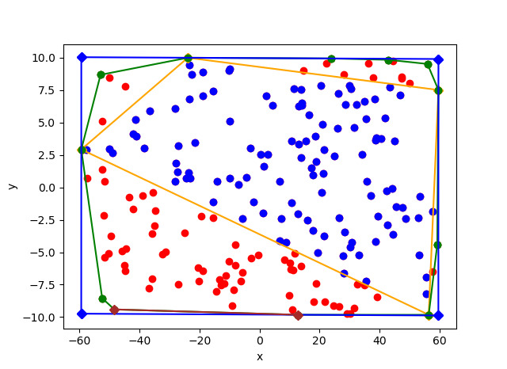

# 📝 simple convex hull #
***

- convex hull sample result

## :gem: References ##
***

1. [explantation and c++ code for gramham scan's convex hull](https://www.geeksforgeeks.org/convex-hull-set-2-graham-scan/)
2. [Minimum-Area Rectangle Containing a Set of Points](https://www.geometrictools.com/Documentation/MinimumAreaRectangle.pdf)
